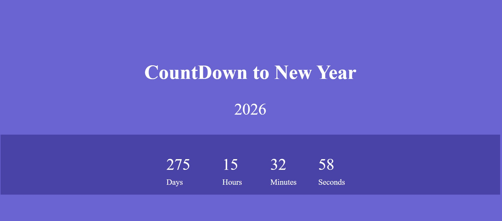

## 🎉 New Year Countdown  

A simple and visually appealing **New Year Countdown** timer built using HTML, CSS, and JavaScript. Watch the countdown tick down to the New Year.  

## 🚀 Features  
- ✅ Displays a live countdown to the New Year  
- ✅ Automatically updates every second  
- ✅ Beautiful and responsive design 

## 🛠 Tech Stack  
HTML, CSS, JavaScript  

## 📷 Screenshots  
  

## 📌 How It Works  
1. The countdown timer automatically calculates the time left until the New Year.  
2. The display updates in real-time, showing days, hours, minutes, and seconds remaining.    

## 📥 Download & Installation  
Clone the repository using Git:  
```bash
git clone https://github.com/luminous44/new-year-countdown.git
```  
Or download the ZIP file manually from [here](https://github.com/luminous44/new-year-countdown/archive/refs/heads/main.zip).  
